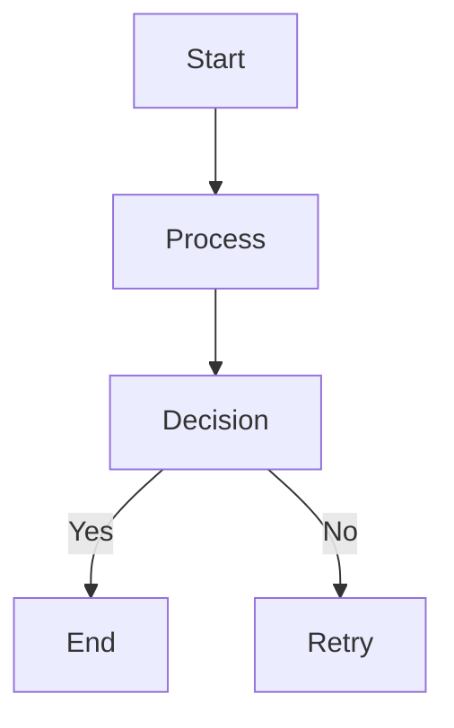
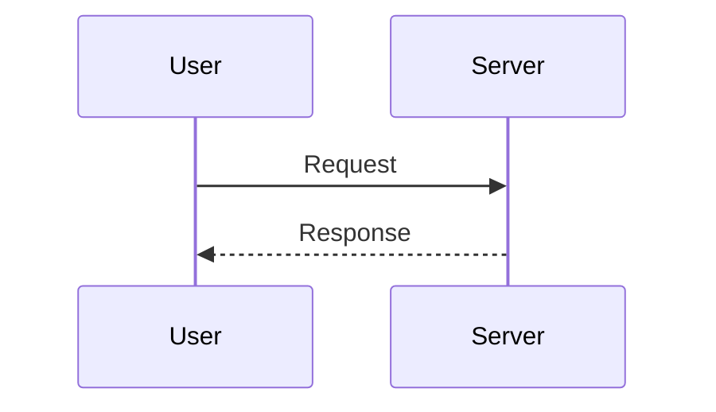
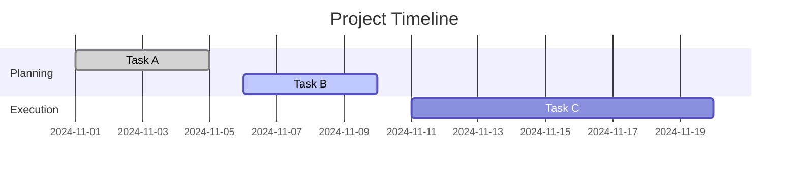
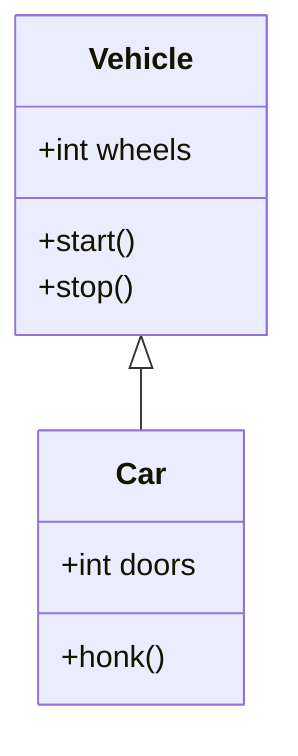
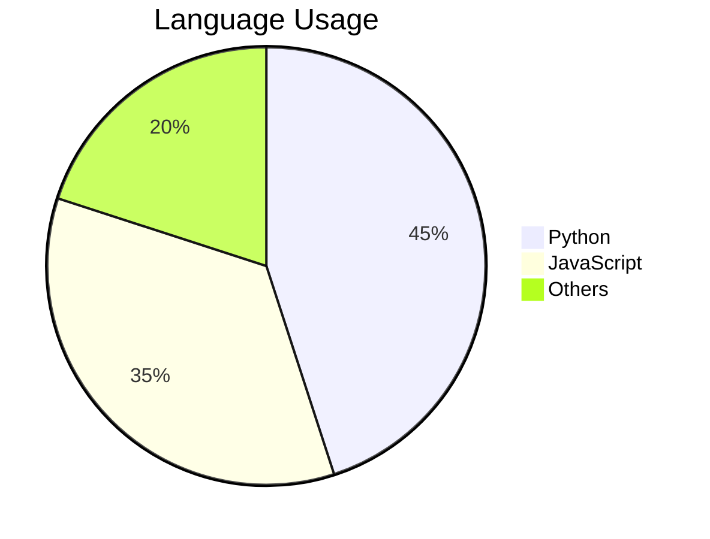
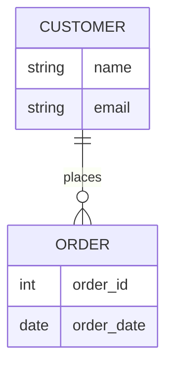
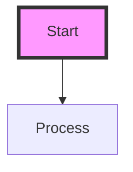
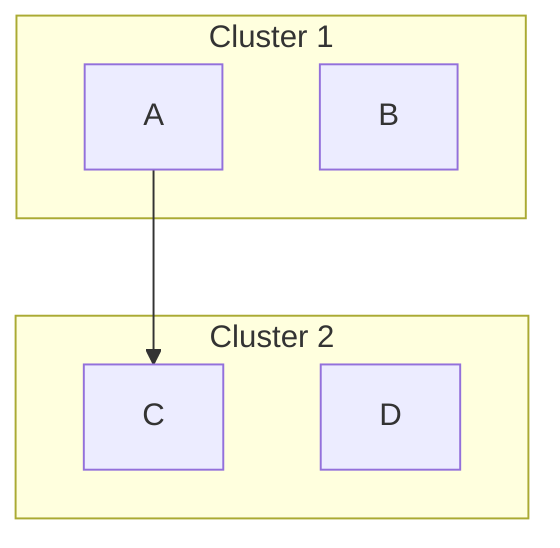

# Mermaid Diagrams

Mermaid is a simple markdown-like scripting language that generates diagrams such as flowcharts, sequence diagrams, Gantt charts, and more. It’s widely used in documentation tools like Markdown and MkDocs.

## Why Use Mermaid?
1. **Readable**: Easy-to-understand syntax.
2. **Dynamic**: Quick to edit and regenerate.
3. **Integrated**: Works in many documentation tools.
4. **Versatile**: Supports various diagram types.

---

## Basic Syntax
1. Start with the `mermaid` code block.
2. Specify the diagram type as the first line.
3. Add the nodes and relationships according to the type.

### Example:


---

## Diagram Types

### 1. Flowcharts
Flowcharts represent processes and decisions.

#### Syntax:
```mermaid
graph LR  // Direction: LR (Left to Right), TD (Top to Down)
A[Start] --> B[Decision]
B -->|Yes| C[End]
B -->|No| D[Retry]
```

#### Example Output:
```
Start → Decision → Yes → End
                   → No → Retry
```

---

### 2. Sequence Diagrams
Sequence diagrams show interactions between components.

#### Syntax:


---

### 3. Gantt Charts
Gantt charts visualize project timelines and task dependencies.

#### Syntax:


---

### 4. Class Diagrams
Class diagrams represent object-oriented structures.

#### Syntax:


---

### 5. Pie Charts
Pie charts represent proportional data.

#### Syntax:


---

### 6. Entity-Relationship Diagrams
Used to model database relationships.

#### Syntax:


---

## Common Features

### Styling Nodes
4. Add styles to nodes using the `style` keyword.
5. Syntax:
   ```mermaid
   style node_id fill:#color,stroke:#color,stroke-width:value;
   ```

Example:


---

### Links
6. Add clickable links to nodes.
7. Syntax:
   ```mermaid
   graph TD
   A[Node Text] --> B
   click A "https://example.com"
   ```

---

### Subgraphs
Group nodes into subgraphs for better organization.

#### Syntax:


---

## Tools Supporting Mermaid
8. **MkDocs**: Integrates Mermaid diagrams into documentation.
9. **VSCode**: Provides live preview extensions for Mermaid.
10. **Obsidian**: Supports Mermaid in Markdown notes.

---

## Summary
11. Mermaid makes it easy to create professional diagrams using a simple scripting language.
12. Supported diagram types include flowcharts, sequence diagrams, Gantt charts, and more.
13. Integrate Mermaid diagrams into your documentation workflow for clear and visual explanations.
