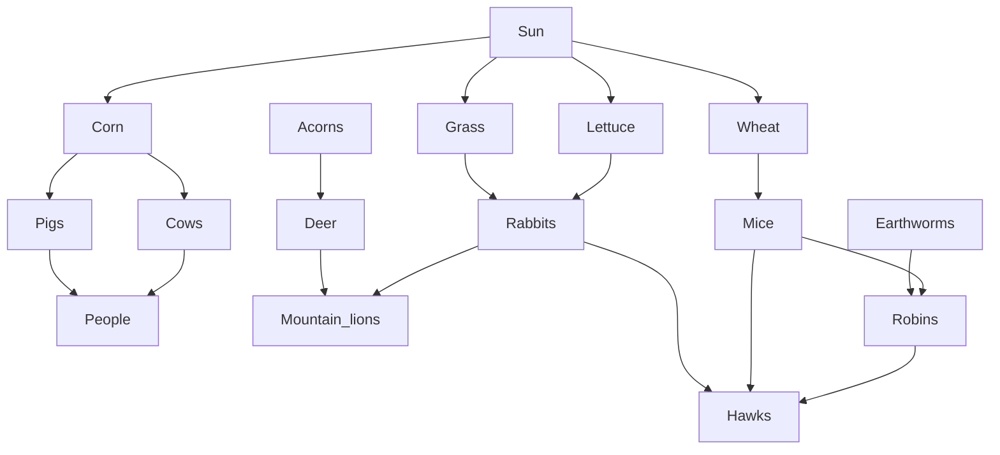
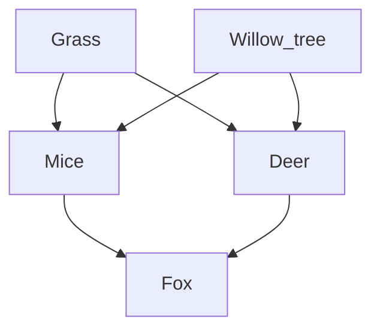

# Food Web Activity: What’s for Dinner?

### Background Information:

Food webs are one of nature’s many cycles. In a food web, omnivores, herbivores, and carnivores comprise the organisms in an ecological community that ensure the continuation of food energy from one organism to another. These webs are made up of individual food chains.

In a grazing web, materials typically pass from plants to herbivores to carnivores. The food web can be viewed not only as a network of chains but also as a series of trophic (nutritional) levels. Green plants, primary producers of food, belong to the first level. Herbivores, consumers of green plants, belong to the second trophic level. Carnivores, predators feeding upon the herbivores, belong to the third. Omnivores, consumers of both plants and animals, belong to the second and third levels. Secondary carnivores, which are predators that feed on predators, belong to the fourth trophic level.

---

### Part 1: Creating Food Webs

**Food Web #1**  
Draw your food web based on your dinner and include the sun as the energy source. Remember that the arrows show the direction of energy movement.

**Food Web #2**  
Construct a food web using the following organisms:

- People
- Rabbits
- Grass
- Lettuce
- Mountain lions
- Robins
- Earthworms
- Hawks
- Mice
- Insects
- Wheat
- Cows
- Corn
- Pigs
- Deer
- Acorns

**Answer:**  
All animal species are dependent on **plants** to harness the sun’s energy. This makes energy available to all consumers.

**Follow-up:**  
Three plants we depend on more than others are **wheat, corn, and rice** because we eat them directly or they feed the animals we eat.

---

### Part 2: Disturbances in Food Webs

In this part of the activity, you will examine how disturbances can affect food webs and the populations of animals within them. Disturbances can be caused by disease, human development, migration, floods, and other natural disasters.

#### Question 1:  
**Answer:** The rat snake population would **decrease** because they would lose a food source (deer mice).

#### Question 2:  
**Answer:** If spiders were wiped out, their **prey** (like insects) might **increase**, while animals that **eat spiders** would struggle and might decrease.

#### Question 3:  
**Answer:** If the American toad was eliminated, the earthworm population might **increase** because there would be fewer toads to eat them.

---

### Simple Food Web

#### Question 4:  
**Answer:** The fox population would **decrease** because they would have fewer mice to eat.

#### Question 5:  
**Answer:** If the deer ate more grass and willow leaves, the mice population would **decrease** because they’d have less food.

#### Question 6:  
**Answer:** If wolves were introduced, they would **eat some of the deer**, which might allow the grass and willow to grow more, helping the mice and other animals that eat plants.

---

### Conclusion:

A food web with many members and many connections is **more likely** to survive disturbances because if one part of the web is affected, there are other species that can fill the gap. If the web has only a few connections, it's more vulnerable.
