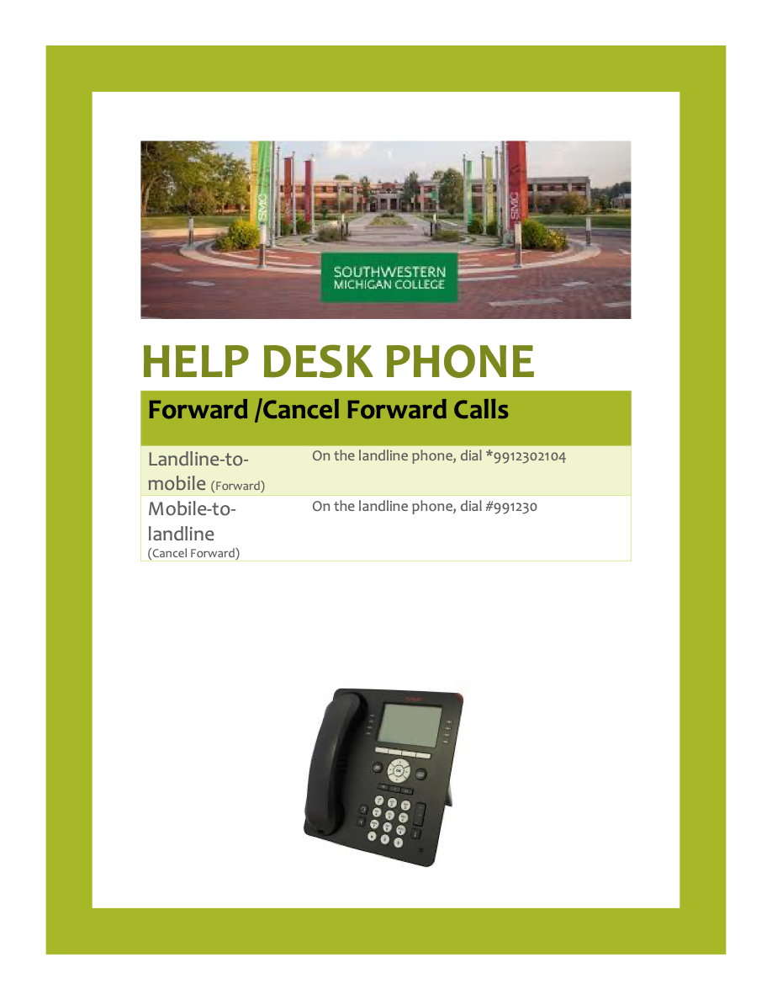

type: Resource
category: SMC

# Help Desk Forwarding

Created: 2022-02-11 14:07:00 -0500

Modified: 2024-10-04 11:40:03 -0400

---

**To forward all calls to a personal cell phone:**

1.  Dial *99 followed by the extension of the phone to be forwarded.
2.  Next, dial 91 followed by the area code (minus the first digit) and the cell number.

Forward all calls Example:

To transfer extension 4321 to Cell # (555) 123-4567 type

*99 **4321** 91 **555 123 4567**

**To cancel all calls forwarded to a personal cell phone:**

1.  Press #99 followed by the extension of the phone that was forwarded.

Cancel forwarding all calls Example:

To cancel forwarding all calls from extension 4321 to a Cell phone type#

*99 **4321** 91 **555 123 4567**

**If you have trouble forwarding your phone, check with Allen to see if it needs to be reset.**

<<[Help-Desk-Phone_revised_6_4_2020.docx](../Attachments/Help-Desk-Phone_revised_6_4_2020.docx)>>

<<[Help-Desk-Phone_revised_6_4_2020.docx](../Attachments/Help-Desk-Phone_revised_6_4_2020.docx).pdf>>

{width="6.375in" height="8.25in"}

